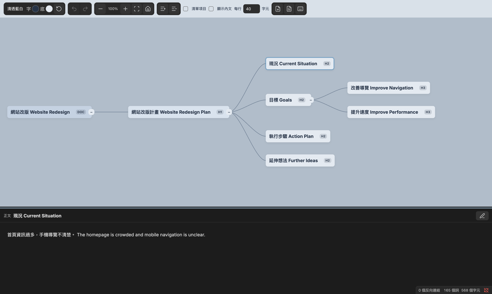

# MindWeave

[English](#english) | [繁體中文](#繁體中文)

## English

Turn your Markdown notes into interactive, editable mind maps in Obsidian. Understand information faster, organize your thoughts, and develop new ideas while keeping your content in Markdown.

Desktop only, requiring Obsidian 1.13.7 or later. Tested on macOS; Windows and Linux still need live verification. Not yet listed in the Obsidian Community directory.

### Introduction videos

- [English introduction](https://www.youtube.com/watch?v=48iJPPwGENs)
- [Chinese introduction](https://www.youtube.com/watch?v=vD3iUtLDmx0)

### Features

- View Markdown headings as nodes, with optional body previews and nested lists.
- Add, rename, delete, and drag nodes to reorganize branches and sibling order.
- Read and edit section content in the native Markdown editor below the map.
- Copy, cut, and paste entire subtrees, including their content. Cutting is limited to the same note; copying works across MindWeave notes.
- Paste external text to create one child node per nonempty line.
- Preview linked notes and sections, preserve link aliases, and expand linked outlines.
- Pan by dragging the background or document root. Zoom around the pointer with the mouse wheel.
- Expand or collapse individual branches or the entire map.
- Choose four themes, customize node colors, and set text wrapping (at least 6 characters per line, with no upper limit).
- Choose Traditional Chinese, Simplified Chinese, English, or Japanese toolbar and shortcut labels. Some editor labels and error messages remain in Traditional Chinese.

### Installation and getting started

1. Download `main.js`, `manifest.json`, and `styles.css` from the [latest release](https://github.com/blktree/mindweave/releases/latest).
2. Place them in `.obsidian/plugins/mindweave/` inside your vault.
3. Restart Obsidian or reload plugins, then enable **MindWeave** under **Settings → Community plugins**.
4. Open a Markdown note and click the lightbulb in the left sidebar. The toolbar document icon switches back to Markdown.
5. Choose your interface language under **Settings → MindWeave → Language**. This changes interface labels, not note content.

### Keyboard and mouse controls

Select a node and focus the canvas first. While editing text, normal editor shortcuts apply. Use Command on macOS and Ctrl on Windows.

| Action | Shortcut |
| --- | --- |
| Edit title | R or double-click |
| Save title | Enter or click the canvas background |
| Cancel title editing | Esc |
| Add sibling / child | Enter / Tab |
| Promote node | Shift + Tab |
| Delete node and subtree | Delete / Backspace |
| Navigate between nodes | Arrow keys |
| Reorder siblings | Option / Alt + ↑ or ↓ |
| Expand / collapse | Space |
| Copy / cut / paste subtree | Cmd/Ctrl + C / X / V |
| Undo / redo | Cmd/Ctrl + Z / Cmd/Ctrl + Shift + Z |
| Edit section content | Cmd/Ctrl + Enter |
| Show / hide content panel | Cmd/Ctrl + Space |
| Zoom around the pointer | Mouse scroll wheel |

Drag a node onto another node to make it a child, or near its upper/lower edge to change order. Drag the bottom divider upward to reveal the content panel. Body editing uses native autosave; Cmd/Ctrl + S also saves.

### Before editing

Edits change your Markdown files, including linked notes you choose to edit. Back up your vault; undo is not a backup. Markdown supports six heading levels, and expanded linked outlines and list nodes have read-only structure.

MindWeave does not upload your notes or collect telemetry. Remote content embedded in notes may still load through Obsidian. Copy and paste use the system clipboard when invoked.

### License and support

Copyright © 2026 blktree. [AGPL-3.0-only](LICENSE) · [Notices](NOTICE) · [Buy Me a Coffee](https://buymeacoffee.com/blktree)

---

## 繁體中文

把 Markdown 筆記轉成可閱讀、編輯與重新分類的心智圖。

可從 [GitHub Releases](https://github.com/blktree/mindweave/releases/latest) 下載，目前尚未在社群目錄上架。支援 Obsidian 桌面版 1.13.7 以上；實機測試平台為 macOS，Windows／Linux 尚待實機驗證，手機版不開放安裝。

## 介紹影片 / Introduction videos

觀看 MindWeave 的功能介紹與操作示範。Watch MindWeave in action:

- [English introduction — MindWeave for Obsidian](https://www.youtube.com/watch?v=48iJPPwGENs)
- [中文介紹 — MindWeave Obsidian 心智圖外掛](https://www.youtube.com/watch?v=vD3iUtLDmx0)

## 使用

開啟 Markdown 筆記後，使用命令「開啟思維導圖」、檔案選單「以 MindWeave 開啟」，或左側燈泡圖示。工具列的文件圖示可切回 Markdown。

設定 → MindWeave → 語言，可選繁體中文、簡體中文、English、日本語。工具列與快捷鍵說明會即時更新；這不是筆記翻譯功能，部分錯誤訊息與編輯介面仍為繁體中文。

- 空白處或文件根節點拖曳整張圖，滾輪以滑鼠位置為中心縮放；適配全圖時靠左。
- R 或雙擊標題開啟大型文字編輯框；Enter 新增同級、Tab 新增子節點、Shift+Tab 升級。
- 節點拖至另一節點中央變成子節點，上／下緣則調整順序。Delete 刪除節點與子樹，可復原。
- Ctrl/Cmd+Z 復原、Ctrl/Cmd+Shift+Z 重做；復原精確恢復 Markdown 原文。
- 個別或全部收合／展開，操作節點位置固定。
- 四套主題、自訂文字與底色、每行至少 6 字（無上限）、內文與階層清單顯示。
- Ctrl/Cmd+C、X、V 複製、剪下與貼上子樹；剪下限同一筆記。外部文字貼上時，每個非空白行建立一個子節點。
- Wiki／Markdown 連結保留別名；選取後預覽連結章節，雙擊展開外部大綱。外部節點的結構操作唯讀，正文可按鉛筆在下方就地編輯並儲存回來源筆記。
- 正文區預設完全收合，可拖曳底部分隔線展開。Ctrl/Cmd+Enter 在下方原生 Markdown 編輯器編輯；自動儲存或 Ctrl/Cmd+S 儲存，點「完成」回到閱讀。
- 原生編輯器維持完整文件，畫面與輸入僅限目前正文；保留圖片貼上、原生復原和編輯器擴充。
- R／雙擊使用節點旁的寬版輸入框，Enter 或點擊畫布空白處儲存、Esc 取消；不是另開對話框。
- 顯示設定按筆記記憶；重新開啟重新適配全圖。

### 使用前提醒

編輯會直接修改 Markdown，包括你選擇編輯的連結筆記。請先備份，復原功能不能取代備份。Markdown 最多支援六級標題；展開的連結大綱與清單節點，其結構為唯讀。

MindWeave 不上傳筆記、不蒐集遙測資料。筆記中的遠端圖片等內容仍可能透過 Obsidian 載入；複製貼上操作會使用系統剪貼簿。

### 授權與支持

Copyright © 2026 blktree。[AGPL-3.0-only 授權](LICENSE) · [著作權聲明](NOTICE) · [支持開發](https://buymeacoffee.com/blktree)
