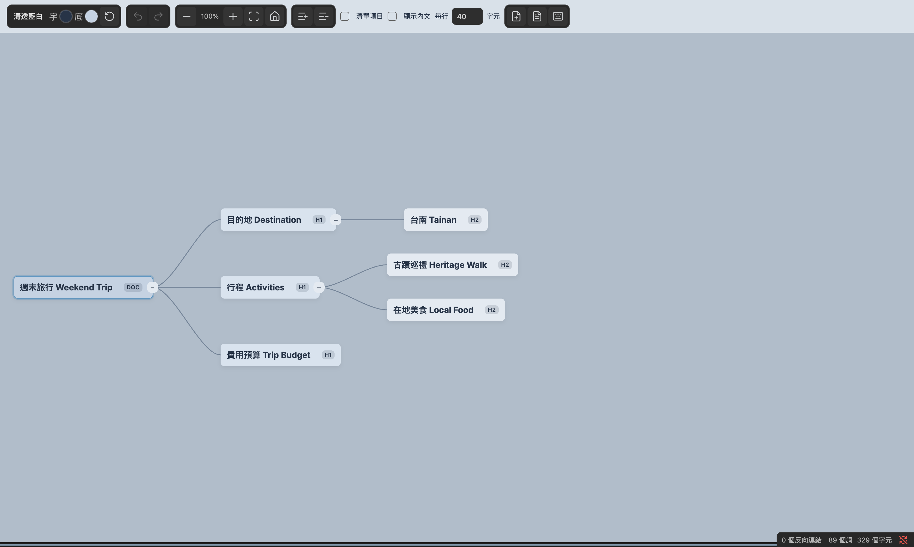
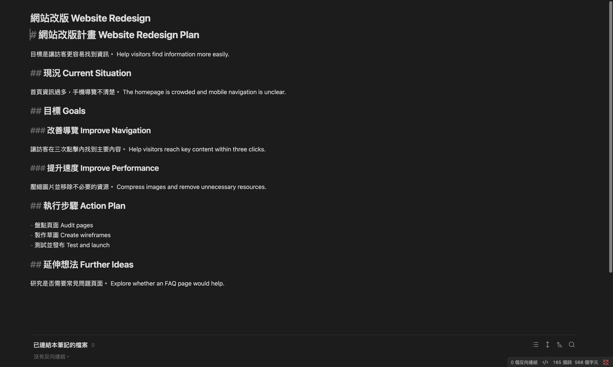

# MindWeave 使用手冊 / User guide

適用版本：0.2.x。以下依目前實作撰寫；文件範例有解析與編輯邏輯測試，不代表所有平台已完成實機驗證。

For version 0.2.x. Examples are checked against the parser and editing logic; this is not a claim of full cross-platform GUI testing.

## 1. 開始之前 / Before you start

MindWeave 讓你把 Markdown 筆記當作心智圖閱讀與編輯，適合快速理解資訊、分類重組，再延伸想法。它不是 AI 自動摘要工具，也不會替你翻譯或自動判斷分類。

MindWeave lets you read and edit Markdown notes as mind maps: understand information, organize it, and develop ideas. It does not automatically summarize, translate, or classify your notes with AI.

- 使用 Obsidian 桌面版 1.13.7 以上。目前實機測試以 macOS 為主，Windows／Linux 尚待完整驗證，手機版不開放安裝。
- Use Obsidian desktop 1.13.7 or later. Live testing has primarily covered macOS; Windows/Linux still require full verification. Mobile installation is disabled.
- 先備份筆記，或在練習用 vault 操作。刪除、重新命名或拖曳節點會直接修改 Markdown，並非只調整圖片。
- Back up your notes or use a practice vault. Deleting, renaming, or reparenting nodes changes the Markdown, not just the diagram.

### 安裝 / Installation

目前尚未在社群目錄上架，不要在社群搜尋中找不到就認為安裝出錯。請從 [GitHub Releases](https://github.com/blktree/mindweave/releases/latest) 下載同版安裝檔，不要下載其他同名外掛。

The plugin is not yet listed in the community directory. Download matching assets from [GitHub Releases](https://github.com/blktree/mindweave/releases/latest), not another similarly named plugin.

手動安裝步驟 / Manual installation:

1. 關閉 Obsidian，先備份 vault。 / Close Obsidian and back up the vault.
2. 在該 vault 的設定目錄建立 `.obsidian/plugins/mindweave/`；若自訂了設定目錄，改用你的設定目錄。 / Create this folder under your vault's configuration directory; substitute your custom configuration directory if applicable.
3. 放入同一版本的 `main.js`、`manifest.json`、`styles.css`；保留一起提供的 `LICENSE`、`NOTICE`。 / Copy the matching build files and retain the supplied license notices.
4. 開啟 Obsidian → 設定 → 社群外掛，依 Obsidian 提示允許社群外掛，啟用 **MindWeave**。 / Open Settings → Community plugins, allow community plugins when prompted, and enable MindWeave.


## 2. Markdown 與節點的關係 / How notes become nodes

| 筆記 / Note | 心智圖 / Mind map |
|---|---|
| 檔名 / File name | 文件根節點，DOC / Document root, DOC |
| `# 標題 / Heading` | 第一級節點，H1 / First-level node, H1 |
| `## 標題 / Heading` | 前一個上層標題的子節點，H2 / Child of the preceding parent heading, H2 |
| `###` 到 `######` | 更深層節點，最多 H6 / Deeper nodes, up to H6 |
| 標題下的段落 / Paragraphs under a heading | 該節點正文 / Node content |
| 清單 / Lists | 勾選「清單項目」後作為唯讀顯示節點 / Read-only display nodes when List items is enabled |

切換檢視不會另存成圖片或另一份心智圖檔案；原始 `.md` 仍是內容來源。純段落不會自動變成多個分類節點，請先用標題整理。

Switching views does not create an image or a separate mind-map file. The original `.md` remains the content source. Plain paragraphs do not automatically become categorized nodes; organize them with headings first.

## 3. 開啟與切換 / Open and switch views

1. 先開啟要閱讀的 Markdown 筆記。 / Open the Markdown note you want to use.
2. 點左側燈泡，或在命令面板搜尋 **MindWeave**，執行「開啟思維導圖」。也可用筆記檔案選單「以 MindWeave 開啟」。 / Click the ribbon lightbulb, search for MindWeave in the command palette, or use its file-menu action. These command/menu labels currently remain in Traditional Chinese.
3. 開啟時會適配全圖，下方正文區預設收合。 / The view initially fits the map, with the content pane collapsed.
4. 要回 Markdown，點工具列文件圖示「切回 Markdown / Switch to Markdown」。 / Use the toolbar's document button to return to Markdown.

## 4. 範例一：從空白建立 / Example 1: Build from scratch

目標：建立「週末旅行」心智圖，練習新增、改標題、寫正文與整理分支。節點文字同時使用中文與英文。

Goal: build a bilingual weekend-trip map while practicing node creation, title editing, content editing, and organization.

### A. 建立根節點 / Create the root

1. 在 Obsidian 建立空白筆記，命名為 `週末旅行 Weekend Trip`。先不要輸入 Markdown。
2. 用燈泡開啟 MindWeave。應看到檔名形成的 DOC 根節點。
3. 點選根節點。後續快捷鍵需在畫布上操作，而不是在文字輸入框內。

1. Create an empty note named `週末旅行 Weekend Trip`; leave its content empty.
2. Open MindWeave using the lightbulb. The file name appears as the DOC root.
3. Select the root. Use subsequent shortcuts on the canvas, not inside a text field.

### B. 建立分類與子項 / Add branches and children

每次新增後會出現標題編輯框，輸入下表文字，再按 Enter 儲存；此時 Enter 是「儲存標題」，不是「再新增同級」。

Each addition opens the title editor. Type the specified title and press Enter to save. Enter inside this editor saves the title; it does not create another sibling.

| 步驟 / Step | 先選取 / Select first | 操作 / Action | 輸入 / Type |
|---|---|---|---|
| 1 | DOC 根節點 / Root | Tab | `目的地 Destination` |
| 2 | 目的地 Destination | Tab | `台南 Tainan` |
| 3 | 目的地 Destination（重新點選 / click again） | Enter | `行程 Activities` |
| 4 | 行程 Activities | Tab | `古蹟巡禮 Heritage Walk` |
| 5 | 古蹟巡禮 Heritage Walk | Enter | `在地美食 Local Food` |
| 6 | 行程 Activities（重新點選 / click again） | Enter | `預算 Budget` |

預期階層 / Expected hierarchy:

```text
週末旅行 Weekend Trip [DOC]
├── 目的地 Destination [H1]
│   └── 台南 Tainan [H2]
├── 行程 Activities [H1]
│   ├── 古蹟巡禮 Heritage Walk [H2]
│   └── 在地美食 Local Food [H2]
└── 預算 Budget [H1]
```

### C. 編輯標題與正文 / Edit titles and content

1. 選取「預算 Budget」，按 `R`，改成 `費用預算 Trip Budget`，Enter 儲存。若不想改，按 Esc 取消。
2. 選取「台南 Tainan」，按 Mac `Cmd + Enter`／Windows `Ctrl + Enter`，在下方正文編輯器輸入：

   `搭火車前往，安排兩天一夜。 Travel by train and stay for one night.`

3. 按 `Cmd/Ctrl + S` 儲存，點「完成」回到閱讀。
4. 用同樣方式，在「古蹟巡禮 Heritage Walk」加入：

   `上午參觀古蹟。 Visit historic sites in the morning.`

5. 在「在地美食 Local Food」加入：

   `下午探索小吃。 Explore local snacks in the afternoon.`

6. 在「費用預算 Trip Budget」加入：

   `先列交通、住宿與餐飲費用。 List transport, accommodation, and food costs first.`

Select Budget, press R, rename it, and save with Enter. To edit each node's content, use Cmd/Ctrl + Enter, type the bilingual sentence above, save with Cmd/Ctrl + S, then click 完成 (Done). R edits the title, not the content.

### D. 整理與確認 / Organize and confirm

- 拖曳「在地美食」到「古蹟巡禮」上緣，練習交換順序；在畫布按 Cmd/Ctrl + Z 復原。
- Drag Local Food to the upper edge of Heritage Walk to reorder it, then undo on the canvas with Cmd/Ctrl + Z.
- 想放到另一分類，拖到該分類中央；這會變成其子節點，並修改 Markdown 層級。
- Drop onto the center of another category to make it a child; this changes Markdown heading levels.
- 點「切回 Markdown」，確認內容與下面一致；空白行數可能不同。
- Switch back to Markdown and compare with the following result. Blank-line spacing may differ.

```markdown
# 目的地 Destination

## 台南 Tainan

搭火車前往，安排兩天一夜。 Travel by train and stay for one night.

# 行程 Activities

## 古蹟巡禮 Heritage Walk

上午參觀古蹟。 Visit historic sites in the morning.

## 在地美食 Local Food

下午探索小吃。 Explore local snacks in the afternoon.

# 費用預算 Trip Budget

先列交通、住宿與餐飲費用。 List transport, accommodation, and food costs first.
```

可直接使用完成範本：[週末旅行 / Weekend Trip](examples/01-weekend-trip.md)。若要練習從零建置，請先照 A–D 操作，最後再對照範本。

The linked template is the finished result. For the from-scratch exercise, follow A–D before comparing it.

完成後的實際畫面 / Actual view of the completed example:



## 5. 範例二：既有 Markdown 轉為心智圖 / Example 2: Visualize an existing note

目標：不重打內容，把既有的「網站改版計畫」切換為心智圖，理解段落與標題的對應。

Goal: visualize an existing website-redesign plan without retyping its content, and see how headings and paragraphs map to nodes.

### A. 準備既有筆記 / Prepare the note

建立 `網站改版 Website Redesign.md`，貼上以下文字；或把[完成範例](examples/02-website-redesign.md)複製到 vault。

Create `網站改版 Website Redesign.md` and paste the following Markdown, or copy the linked example into your vault.

```markdown
# 網站改版計畫 Website Redesign Plan

目標是讓訪客更容易找到資訊。 Help visitors find information more easily.

## 現況 Current Situation

首頁資訊過多，手機導覽不清楚。 The homepage is crowded and mobile navigation is unclear.

## 目標 Goals

### 改善導覽 Improve Navigation

讓訪客在三次點擊內找到主要內容。 Help visitors reach key content within three clicks.

### 提升速度 Improve Performance

壓縮圖片並移除不必要的資源。 Compress images and remove unnecessary resources.

## 執行步驟 Action Plan

- 盤點頁面 Audit pages
- 製作草圖 Create wireframes
- 測試並發布 Test and launch

## 延伸想法 Further Ideas

研究是否需要常見問題頁面。 Explore whether an FAQ page would help.
```

### B. 切換檢視 / Switch views

切換前的 Markdown 編輯畫面 / Markdown editor before switching:



1. 在 Obsidian 開啟這份筆記，點左側燈泡。
2. 初始圖應呈現下列階層。DOC 根節點來自檔名，H1 來自第一行標題，因此兩者同時出現是正常的。
3. 圖太小時，把滑鼠移到想看的分支，用滾輪放大；按住空白處拖曳移動。要重新看全貌，點「適配全圖」。

1. Open the note and click the ribbon lightbulb.
2. Compare the hierarchy below. The DOC root is the file name; the H1 node is the note's first heading. Having both is expected.
3. Zoom near the branch you want to inspect with the mouse wheel. Drag empty canvas space to pan. Use Fit entire map to return to an overview.

```text
網站改版 Website Redesign [DOC]
└── 網站改版計畫 Website Redesign Plan [H1]
    ├── 現況 Current Situation [H2]
    ├── 目標 Goals [H2]
    │   ├── 改善導覽 Improve Navigation [H3]
    │   └── 提升速度 Improve Performance [H3]
    ├── 執行步驟 Action Plan [H2]
    └── 延伸想法 Further Ideas [H2]
```

### C. 閱讀正文與清單 / Read content and lists

1. 點「現況 Current Situation」：下方正文區應顯示首頁與手機導覽的說明。若正文區太小，拖曳底部分隔線向上。
2. 勾選「顯示內文 / Show content」：節點卡片增加正文摘要，不是把所有段落變成獨立節點；目前摘要最多取前 180 個字串單位，完整內容仍看下方。
3. 勾選「清單項目 / List items」：「執行步驟」下會顯示三個清單項目。這些 LI 節點是唯讀展示，不是 H3 標題；要修改清單文字請編輯「執行步驟」的正文或原始 Markdown。

Select Current Situation to read its content below; drag the bottom divider upward if needed. Show content adds a short excerpt to node cards, not separate paragraph nodes. List items displays the three action items as read-only LI nodes. Edit the parent content or source Markdown to change those list items.

切換後並選取「現況」：下方顯示該節點的中英文正文。 / After switching and selecting Current Situation, its bilingual content appears below.


以上是 Obsidian 桌面版實際截圖，使用清透藍白主題、每行 40 字元；不是合成示意圖。你的視窗大小與主題可能讓排版略有不同。

These are actual Obsidian desktop screenshots using Blue mist and 40 characters per line, not mockups. Your window size and theme may change the layout.

### D. 延伸想法並回到原文 / Develop an idea and return to the source

1. 取消勾選「清單項目」，讓畫面專注於標題。
2. 選取「延伸想法 Further Ideas」，按 Tab，輸入 `常見問題 FAQ`，Enter 儲存。
3. 選取新節點，用 Cmd/Ctrl + Enter 加入：

   `整理使用者最常詢問的五個問題。 Collect the five questions users ask most often.`

4. 儲存正文並點「完成」，再切回 Markdown。應看到「延伸想法」下新增了 `### 常見問題 FAQ` 與正文；不是另產生第二份筆記。

Turn off List items, select Further Ideas, and press Tab to add `常見問題 FAQ`. Edit its content with Cmd/Ctrl + Enter using the sentence above. Save, finish editing, and switch back to Markdown: the original note now contains the new H3 heading and its content.

驗收重點：單純切換檢視不應改動原文；只有完成 D 的新增／編輯後，原始筆記才會增加內容。

Check: switching views alone should not change the note. Only the explicit additions and edits in D add content to the original file.

## 6. 日常操作 / Everyday controls

| 操作 / Control | 用途與注意事項 / Behavior |
|---|---|
| 拖曳空白處或 DOC / Drag canvas or DOC | 平移整張圖，不更改標題階層 / Pan without changing the hierarchy |
| 滾輪 / Mouse wheel | 以滑鼠所在位置為中心縮放 / Zoom around the pointer |
| `−`、`+` | 縮小、放大 / Zoom out, zoom in |
| 適配全圖 / Fit entire map | 把整張圖放進可視範圍；圖越大，文字可能越小 / Fit all nodes; large maps may have small text |
| 回到原點 / Reset view | 重設視角，不等於適配全圖 / Reset the camera, not the same as fitting the map |
| 節點旁 `−`、`+` / Node toggle | 收合、展開既有子節點 / Collapse or expand children |
| 全部展開／收合 / Expand/collapse all | 控制目前導圖分支，不會自動讀入所有尚未展開的連結筆記 / Toggle branches, not recursively load every linked file |
| 主題與「字／底」 / Theme and Text/Fill | 主題改變整體顯示；色盤只改選取節點 / Theme affects the view; color pickers affect the selected node |
| 恢復預設色 / Reset selected node colors | 移除所選節點的自訂顏色 / Remove that node's color overrides |
| 每行字元 / Characters per line | 至少 6 字、無上限，影響卡片換行，不在 Markdown 標題插入換行 / Set visual wrapping without inserting Markdown line breaks |

主題、節點顏色與收合狀態按筆記記憶；每行字數、「顯示內文」「清單項目」是共用顯示設定。語言也是全域設定。切換語言不會翻譯節點內容。

Themes, node colors, and folding are remembered per note. Wrapping, Show content, List items, and language are shared settings. Language changes do not translate your notes.

## 7. 快捷鍵 / Keyboard shortcuts

先點選節點，把焦點留在畫布。編輯框內的 Enter、Tab、方向鍵與復原依編輯器行為處理，不是下表的畫布操作。

Select a node and keep focus on the canvas. Inside text editors, keys operate on text instead.

| 功能 / Action | macOS | Windows |
|---|---|---|
| 編輯標題 / Edit title | R / 雙擊 Double-click | R / 雙擊 Double-click |
| 儲存標題 / Save title | Enter / 點畫布空白處 Click canvas background | Enter / 點畫布空白處 Click canvas background |
| 複製／剪下／貼上子樹 / Copy, cut, paste subtree | Cmd + C / X / V | Ctrl + C / X / V |
| 新增同級 / Add sibling | Enter | Enter |
| 新增子節點 / Add child | Tab | Tab |
| 提升一級 / Promote | Shift + Tab | Shift + Tab |
| 刪除節點與整個子樹 / Delete subtree | Delete（⌫） | Delete / Backspace |
| 展開／收合 / Toggle folding | Space | Space |
| 選同層上一／下一個 / Previous/next sibling | ↑ / ↓ | ↑ / ↓ |
| 選父／第一個子節點 / Parent/first child | ← / → | ← / → |
| 同級排序 / Reorder siblings | Option + ↑ / ↓ | Alt + ↑ / ↓ |
| 編輯正文 / Edit content | Cmd + Enter | Ctrl + Enter |
| 復原 / Undo | Cmd + Z | Ctrl + Z |
| 重做 / Redo | Cmd + Shift + Z | Ctrl + Shift + Z / Ctrl + Y |
| 顯示／收合正文 / Toggle content pane | Cmd + Space | Ctrl + Space |

Mac 的 Cmd + Space 或 Windows 的 Ctrl + Space 可能被系統／輸入法攔截，請改拖曳底部分隔線。方向鍵不跨越同級邊界；已收合的節點先按 Space 展開，再按 → 進入子節點。

The system or input method may intercept Cmd/Ctrl + Space; drag the bottom divider instead. Up/down stay within siblings. Expand a folded node with Space before entering its children with Right.

DOC 沒有同級節點，不能用 Enter 新增同級；請用 Tab 新增 H1。標題最多 H6，不能繼續新增更深層節點。根節點檔名請在 Obsidian 檔案總管重新命名。

The DOC root has no siblings; use Tab to add an H1. Markdown headings stop at H6. Rename the root through Obsidian's file explorer.

複製與貼上包含正文與子節點；剪下僅限同一筆記，貼上成功才移除來源。外部文字每個非空白行貼成一個子節點。文件根節點與唯讀節點不能複製或剪下。

Copy/paste includes content and descendants. Cutting is limited to one note and removes the source only after a successful paste. Each nonempty line of external text becomes a child node. File roots and read-only nodes cannot be copied or cut.

## 8. 連結筆記 / Linked notes

節點標題若完整使用內部連結，例如 `## [[研究筆記#發現|研究發現 Research Findings]]`，會顯示別名。目標筆記與標題必須真的存在；這裡的示意連結不包含在兩個範例檔中。

When the entire heading is an internal link, its alias becomes the label. The target note and heading must exist; this illustrative link is not included in the example files.

- 單擊：在正文面板閱讀目標內容。 / Single-click: read the target content below.
- 雙擊：展開連結大綱，而不是編輯標題；改別名請按 R。 / Double-click: expand its outline; use R to edit the alias.
- 外部展開節點的結構唯讀，不能直接拖曳重組或刪除；正文可編輯，會儲存回連結來源筆記。 / Expanded external nodes are structurally read-only. Their editable content is saved to the linked source note.
- 工具列「新增 Markdown 檔案節點」是選擇既有筆記建立連結，不是建立空白檔案。 / Add Markdown file node selects an existing note to link; it does not create a new empty file.

一般網頁 URL 不等於可展開的 vault 筆記。標題中只有一小段連結時，也不要期待整個節點自動變成連結大綱。

Web URLs are not expandable vault notes. A link embedded within a longer heading does not turn the entire node into a linked outline.

## 9. 常見問題與安全 / Troubleshooting and safety

**只看到根節點？ / Only the root is visible?**

檢查筆記有沒有 `# `、`## ` 等標題，以及根節點是否收合。單純粗體字不等於標題。

Check for Markdown headings and whether the root is collapsed. Bold text alone is not a heading.

**文字太小或太擠？ / Text too small or crowded?**

先收合不看的分支，再放大；調整每行字元。適配大型導圖會縮小所有節點，並不保證每個字都能同時清楚閱讀。

Collapse unrelated branches, zoom in, and adjust wrapping. Fitting a large map trades text size for an overview.

**按鍵沒有作用？ / Keys do nothing?**

先點選節點，確認不在標題或正文編輯器。也確認不是根節點新增同級、H6 新增子節點，或外部唯讀節點的結構操作。

Select a node outside an editor. Check that the action is valid: no root siblings, no children beyond H6, and no structural edits on read-only external nodes.

**刪錯能復原嗎？ / Can deletion be undone?**

在畫布立即用 Cmd/Ctrl + Z。刪除包含該標題、正文與所有子標題；復原不是備份系統，重新開啟或外部內容更新可能清除結構歷史。正文編輯器有自己的復原歷史。

Use Cmd/Ctrl + Z on the canvas immediately. Deletion removes the heading, content, and descendants. Undo is not a backup: reopening or external edits may clear structural history. The content editor has separate undo history.

**遇到「筆記已在其他地方修改」？ / Concurrent-edit warning?**

先保留目前輸入，不要強制覆蓋；回到原始 Markdown 比對後重新開啟編輯。避免在兩個視窗同時編輯同一段內容。

Preserve your input, compare against the source note, and reopen editing. Avoid editing the same content simultaneously in two windows.

回報問題請到 [GitHub Issues](https://github.com/blktree/mindweave/issues)，提供 Obsidian 版本、作業系統、操作步驟、預期與實際結果，以及移除私人資訊後的最小 Markdown 範例。尚未驗證的行為請勿視為已保證支援。

Report issues with your Obsidian version, operating system, steps, expected/actual results, and a minimal anonymized Markdown example. Do not upload private notes or credentials.
